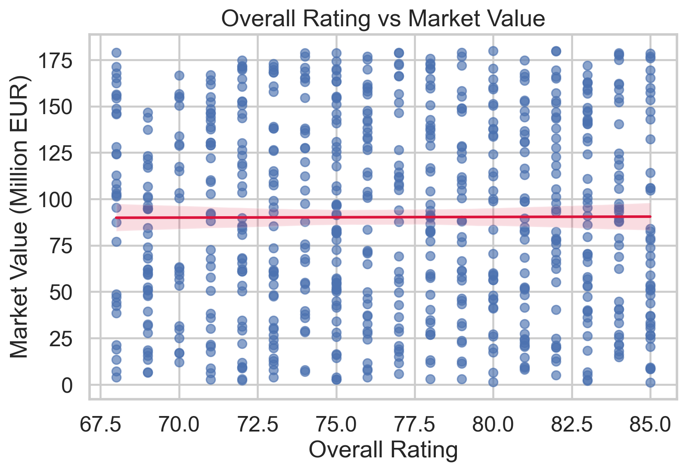
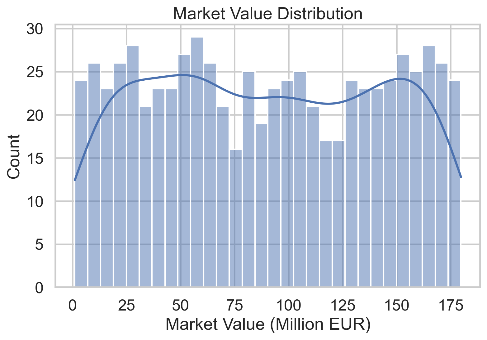

# ⚽ EDA: FIFA Player Market Value Analysis & Streamlit Dashboard

<p align="center">
  
</p>

<p align="center">
  
  
  
  
  
</p>

---

## 📊 Overview

This project performs **Exploratory Data Analysis (EDA)** on FIFA player data to uncover patterns and identify the key factors influencing player market value.

It combines:

* 📈 Statistical Analysis
* 📊 Data Visualization
* 🔍 Correlation Insights
* 🧠 Hypothesis-Based Analysis
* 🖥️ Interactive Dashboard (Streamlit)

---

## 🎯 Objectives

* Identify factors affecting player market value
* Develop **analytical thinking and data exploration skills**
* Build an interactive dashboard for real-time insights

---

## 📂 Project Structure

```
EDA-FIFA-Market-Value/
│
├── datasets/
├── notebook/
├── src/
├── dashboard/
├── images/
│   ├── distributions/
│   ├── correlations/
│   ├── outliers/
│
├── report/
├── README.md
```

---

## 📈 Key Features

✔ Statistical summaries (mean, median, distribution)
✔ Data visualizations (histograms, scatter plots, heatmaps)
✔ Correlation analysis
✔ Outlier detection
✔ Hypothesis-based analysis
✔ Multi-variable analysis
✔ Interactive Streamlit dashboard

---

## 📊 Visual Insights

### 🔹 Distribution Analysis

<p align="center">
  
  
</p>

---

### 🔹 Correlation Analysis

<p align="center">
  
</p>

---

### 🔹 Relationship Analysis

<p align="center">
  
</p>

---

### 🔹 Outlier Detection

<p align="center">
  
</p>

---

## 🖥️ Dashboard

> Interactive Streamlit dashboard for exploring player data

<p align="center">
  
  
</p>

---

## 🧠 Key Insights

* Higher-rated players tend to have higher market value
* Market value distribution is **right-skewed**
* Performance metrics strongly influence player valuation
* Age and rating together impact market value

---

## 🛠️ Tech Stack

* Python
* Pandas
* NumPy
* Matplotlib
* Seaborn
* Streamlit

---

## ▶️ How to Run

```bash
git clone https://github.com/your-username/fifa-market-value-eda-dashboard.git
cd fifa-market-value-eda-dashboard
pip install -r requirements.txt
streamlit run dashboard/app.py
```

---

## 📄 Report

Detailed analysis available in:

```
report/report.md
```

---

## 📜 License

This project is licensed under the **Apache License 2.0**.

---

## 🤝 Connect With Me

GitHub: https://github.com/rukeshsg
LinkedIn: https://www.linkedin.com/in/rukesh-s-g-6531bb3b7/
