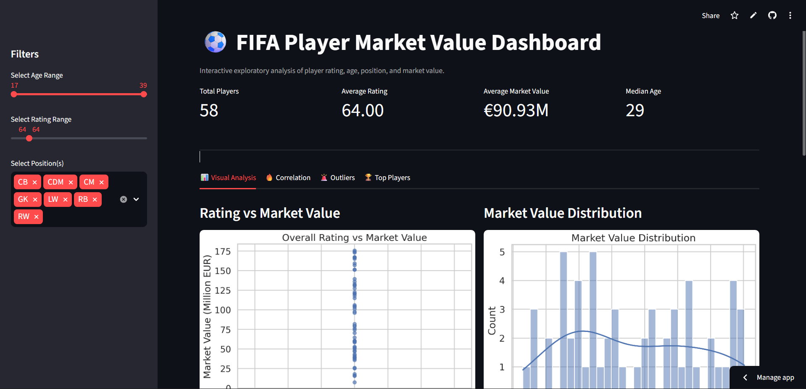
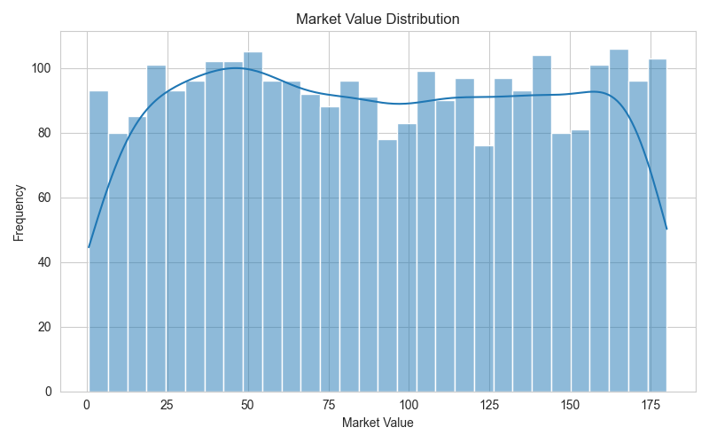
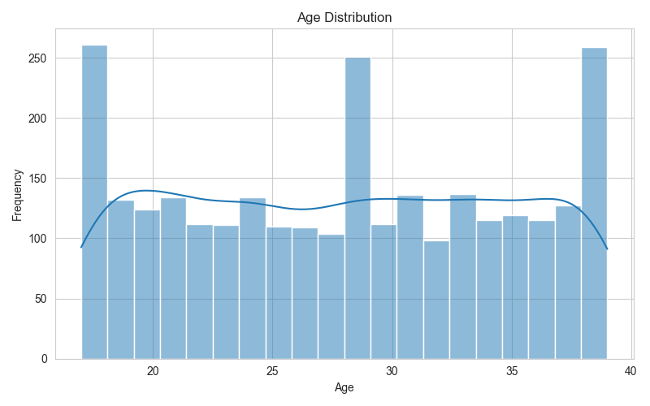
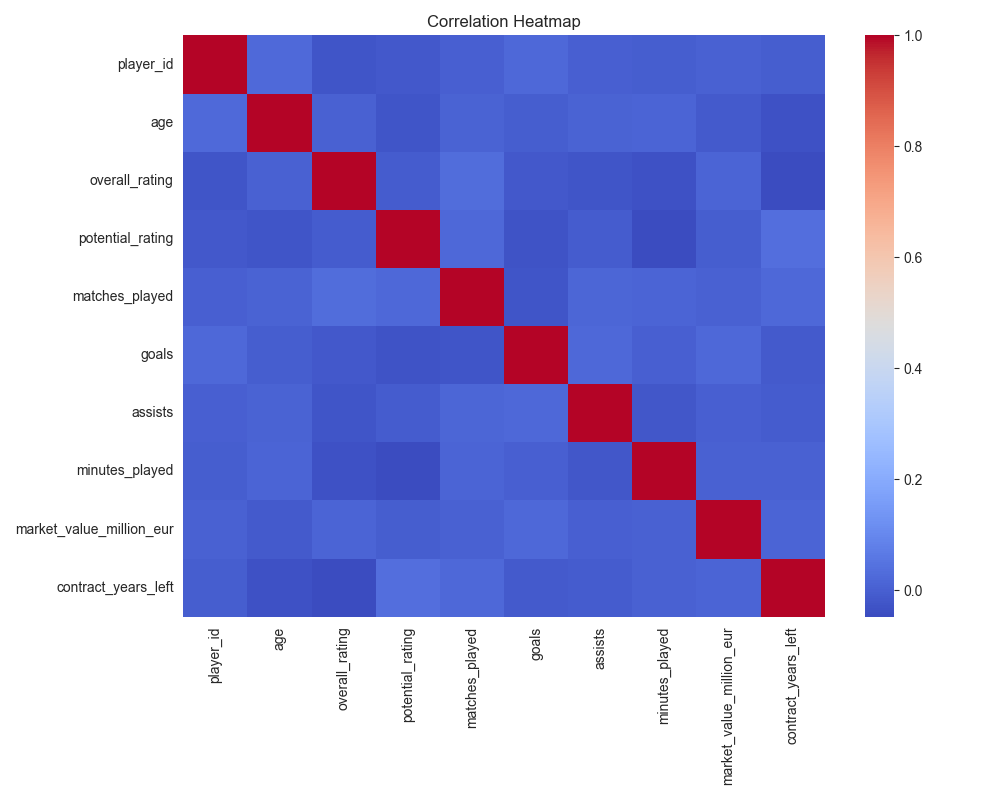
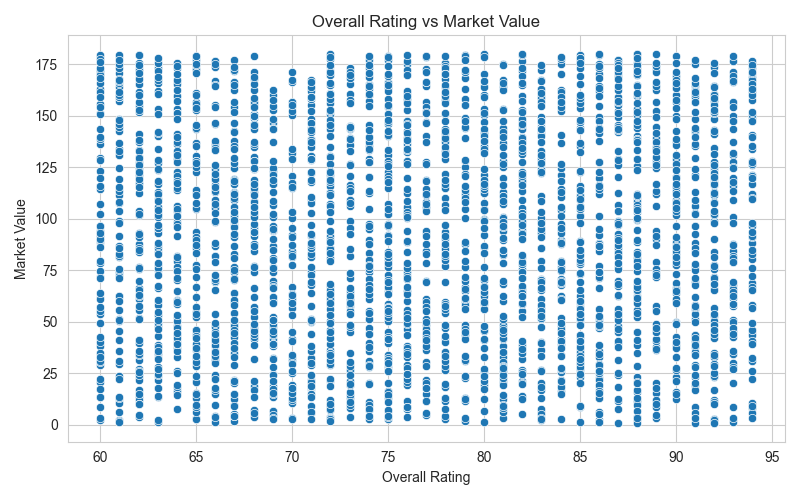
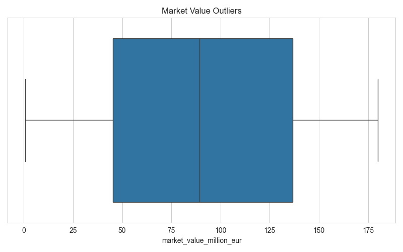

# ⚽ EDA: FIFA Player Market Value Analysis & Streamlit Dashboard

<p align="center">
  
  
  
  
  
</p>

---

## 🌐 Live Dashboard

<p align="center">
  <a href="https://eda-fifa-player-market-value-analysis-kc5bv9c83zlj97ymnfmzai.streamlit.app/" target="_blank">
    
  </a>
</p>

<p align="center">
  🚀 Click the image above to explore the live interactive dashboard
</p>

---

## 📊 Overview

This project performs **Exploratory Data Analysis (EDA)** on FIFA player data to identify key factors influencing player market value.

It includes:

* Statistical analysis
* Data visualization
* Correlation insights
* Hypothesis-based reasoning
* Interactive Streamlit dashboard

---

## 🎯 Objectives

* Identify factors affecting player market value
* Develop analytical thinking and data exploration skills
* Build an interactive dashboard for insights

---

## 📂 Project Structure

```
EDA-FIFA-Market-Value/
│
├── datasets/
├── notebook/
├── src/
├── dashboard/
├── images/
│   ├── distributions/
│   ├── correlations/
│   ├── outliers/
│   └── dashboard/
├── report/
├── README.md
```

---

## 📈 Key Features

* Statistical summaries
* Data visualizations
* Correlation analysis
* Outlier detection
* Hypothesis-based analysis
* Multi-variable analysis
* Interactive Streamlit dashboard

---

## 📊 Visual Insights

### Distribution Analysis

<p align="center">
  
  
</p>

### Correlation Analysis

<p align="center">
  
</p>

### Relationship Analysis

<p align="center">
  
</p>

### Outlier Detection

<p align="center">
  
</p>

---

## 🧠 Key Insights

* Higher-rated players tend to have higher market value
* Market value distribution is right-skewed
* Performance metrics strongly influence valuation
* Age and rating together impact value

---

## 🛠️ Tech Stack

* Python
* Pandas
* NumPy
* Matplotlib
* Seaborn
* Streamlit

---

## ▶️ How to Run

```bash
git clone https://github.com/rukeshsg/EDA-FIFA-Player-Market-Value-Analysis.git
cd EDA-FIFA-Player-Market-Value-Analysis
pip install -r requirements.txt
streamlit run dashboard/app.py
```

---

## 📄 Report

```
report/report.md
```

---

## 📜 License

Apache License 2.0

---

## 🤝 Connect With Me

<p align="center">
  <a href="https://github.com/rukeshsg" target="_blank">
    
  </a>
  
  &nbsp;&nbsp;&nbsp;&nbsp;
  
  <a href="https://www.linkedin.com/in/rukesh-s-g-6531bb3b7/" target="_blank">
    
  </a>
</p>g